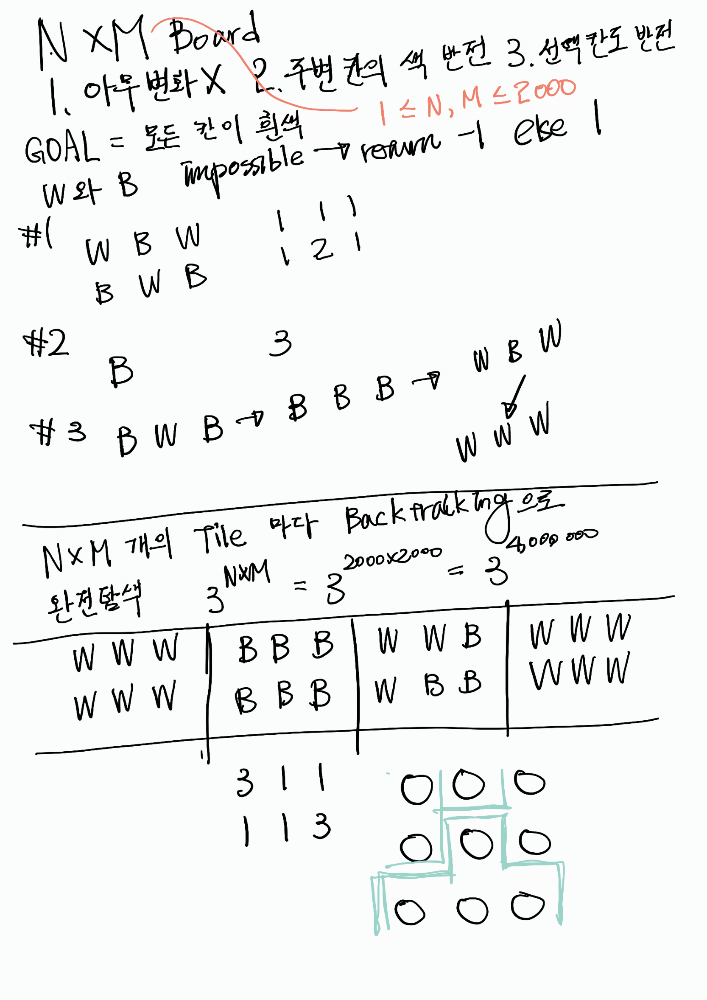
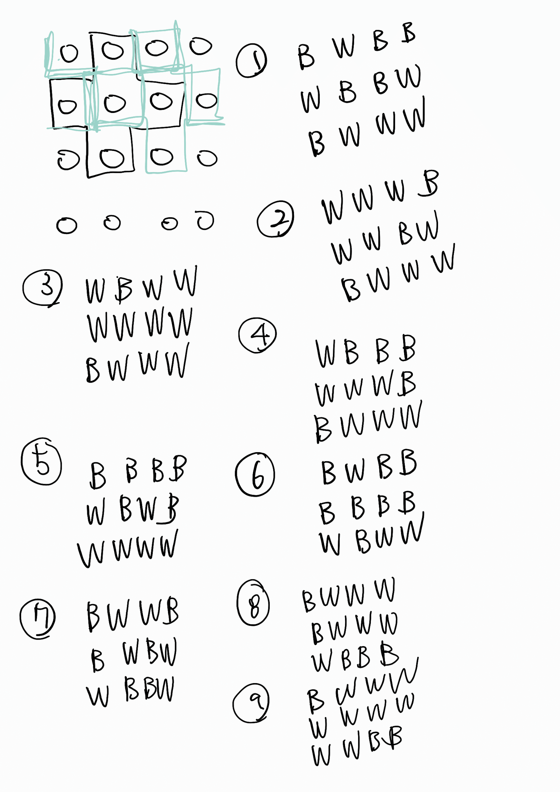
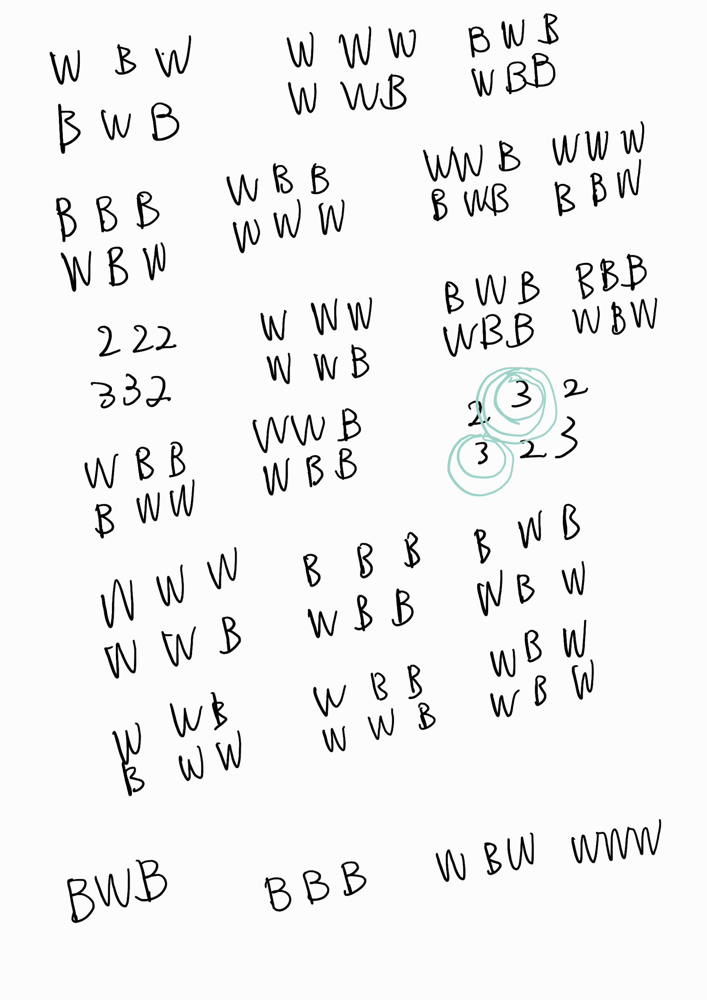
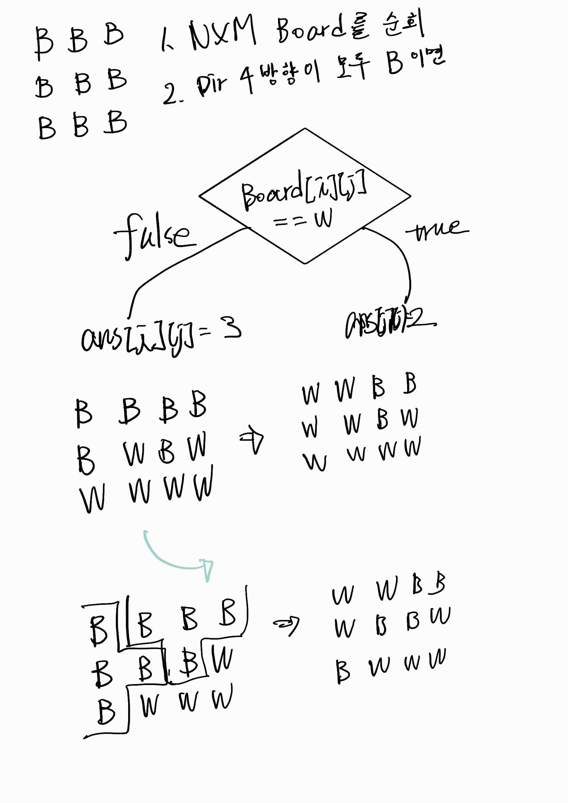
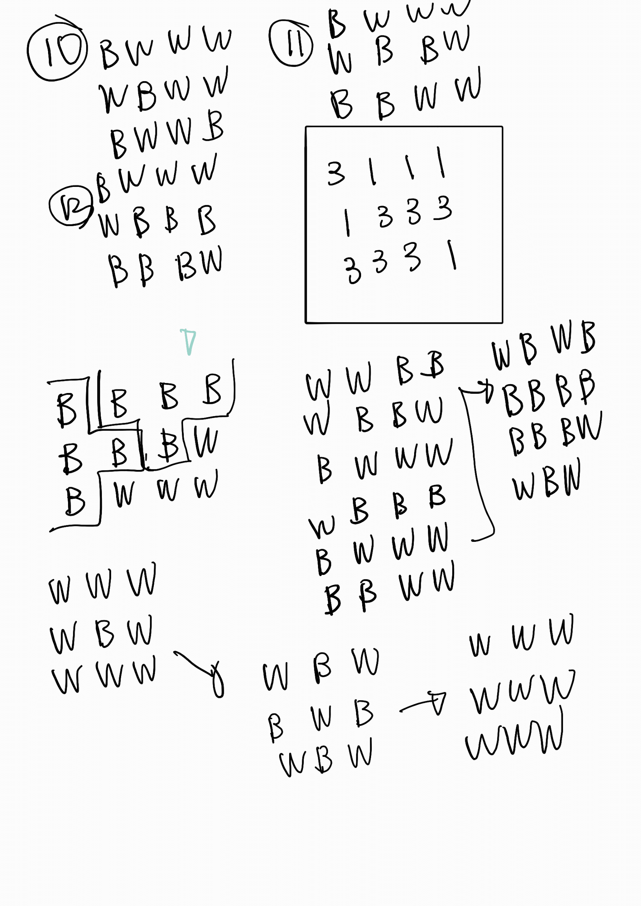

# 250426 코드 리뷰

그룹명: 사내용 해적단
생성 일시: 2025년 4월 26일 오후 11:04
활동 유형: 코드 리뷰

# 백준 17302번 흰색으로 만들기

## 문제 소개

### 문제 링크

[17302번: 흰색으로 만들기](http://boj.ma/17302)

### 설명

*N*행 *M*열 격자판의 각 격자가 흰색 또는 검은색으로 칠해져 있다. 각 칸에 대해 다음의 3가지 중 1가지 행동을 취할 수 있다.

1. 아무 변화도 주지 않는다.
2. 선택한 칸과 인접한 모든 칸의 색을 반전시킨다. 단, 선택한 칸은 반전시키지 않는다.
3. 선택한 칸 및 그 칸과 인접한 모든 칸의 색을 반전시킨다.

당신은 모든 칸을 흰색으로 만들고자 한다. 모든 칸을 흰색으로 만드는 방법을 구하여라.

### 입력

첫 줄에 *N*과 *M*이 주어진다. (1 ≤ *N*, *M* ≤ 2,000)

다음 줄부터 *N*개의 줄에 걸쳐 각 행의 상태를 나타내는 길이 *M*의 문자열이 주어진다. 모든 문자열은 `'B'`와 `'W'`로 이루어져 있다. *i* 번째 줄, *j* 번째 문자가 `'B'`일 경우 해당 칸이 검은색이며 `'W'`일 경우 해당 칸이 흰색임을 의미한다.

### 출력

만약 모든 칸을 흰색으로 만드는 것이 불가능하다면 첫 줄에 `-1`을 출력한다.

가능하다면 첫 줄에 `1`을 출력하고, 다음 줄부터 *N*개의 줄에 걸쳐 *M*개의 수를 공백 없이 출력한다.

*i* 번째 줄의 *j* 번째 수는 *i* 번째 줄, *j* 번째 칸에 취한 행동을 나타낸다. `1`은 아무런 변화를 주지 않은 것, `2`는 인접한 모든 칸을 반전시킨 것, `3`은 그 칸 및 인접한 모든 칸을 반전시킨 것을 의미한다.

만약 가능한 답이 여럿이라면 그 중 아무것이나 출력한다.

## 사고 과정

### 문제의 요구사항

모든 타일의 색상을 흰색으로 만드는 것

이 때의 연산을 출력한다

### 완전탐색 시도

NxM 크기의 모든 타일에 수행 가능한 각각의 3가지의 경우의 수를 모두 탐색하여 흰색 타일로 만들 수 있는지 체크한다.

→ 가장 단순한 방법

### 시간복잡도는?

테스트케이스로 주어지는 타일의 최대 개수는 NxM

하나의 타일에 대한 연산의 종류는 총 3가지

즉 모든 타일에 대해 가능한 모든 연산을 합하면

최악의 경우 O((NxM)^3)이 된다.

여기서 N과 M의 최대 크기는 각각 2,000

최악의 케이스는 O(4000000^3) → 통과 불가하다는 결론이 나온다.

### 결론적으로 완전탐색이 아닌 다른 방법을 찾아봐야 한다.

일일이 손으로 노가다하면서 풀면서 문제를 열심히 관찰해본다…

- 당시 과정
    
    
    
    
    
    
    
    
    
    
    
    
    
    

### 2시간 만에 발견한 핵심

```
1. 아무 변화도 주지 않는다.
2. 선택한 칸과 인접한 모든 칸의 색을 반전시킨다. 단, 선택한 칸은 반전시키지 않는다.
3. 선택한 칸 및 그 칸과 인접한 모든 칸의 색을 반전시킨다.
```

원하는 칸만 반전시키기 위해선 2번 규칙과 3번 규칙을 수행해주면 된다.

하지만, 한개의 칸에는 한개의 행동만 수행할 수 있다.

→ 해결책은?

1. 일단 모든 타일에 2번 규칙을 수행한다.
2. 그 후 B인 타일이 있으면? → 거기는 2 대신 3번 규칙을 수행한다.
    
    왜냐, 2번 규칙과 3번 규칙의 차이는 가운데 타일의 색을 반전 시키는가, 아닌가이기 때문
    

## 코드

```cpp
#define MAX_ROW 2000
#define MAX_COL 2000
#include <iostream>
using namespace std;

int dy[] = { -1, 1, 0, 0 };
int dx[] = { 0, 0, -1, 1 };

char board[MAX_ROW][MAX_COL];
int ansTable[MAX_ROW][MAX_COL];

int N, M;
int cntB = 0;

void printAnswer()
{
	cout << "1\n";
	for (int i = 0; i < N; i++)
	{
		for (int j = 0; j < M; j++)
		{
			cout << ansTable[i][j];
		}
		cout << "\n";
	}
}

int main()
{
	ios::sync_with_stdio(false);
	cin.tie(nullptr);

	char row[MAX_COL + 1];
	cin >> N >> M;
	for (int i = 0; i < N; i++)
	{
		cin >> row;
		for (int j = 0; j < M; j++)
		{
			board[i][j] = row[j];
			if (board[i][j] == 'B')
				cntB++;
		}
	}

	for (int i = 0; i < N; i++)
	{
		for (int j = 0; j < M; j++)
		{
			ansTable[i][j] = 1;
		}
	}

	for (int i = 0; i < N; i++)
	{
		for (int j = 0; j < M; j++)
		{
			for (int k = 0; k < 4; k++)
			{
				int ny = i + dy[k];
				int nx = j + dx[k];
				if (ny >= N || ny < 0 || nx >= M || nx < 0)
					continue;
				if (board[ny][nx] == 'W')
				{
					board[ny][nx] = 'B';
					cntB++;
				}
				else if (board[ny][nx] == 'B')
				{
					board[ny][nx] = 'W';
					cntB--;
				}
			}
			ansTable[i][j] = 2;
			if (cntB == 0)
			{
				printAnswer();
				return 0;
			}
		}
	}

	cout << "1\n";

	for (int i = 0; i < N; i++)
	{
		for (int j = 0; j < M; j++)
		{
			if (board[i][j] == 'B')
			{
				cout << "3";
			}
			else
			{
				cout << "2";
			}
		}
		cout << "\n";
	}

	return 0;
}
```

## 결론

문제를 풀고 보니 단순한 문제였다…

하지만, 문제를 해결하기 위한 Key를 찾아내는 것은 결코 쉽지 않았다.

좀 더 많은 문제를 해결하면서 각각의 문제에 맞는 핵심 포인트를 찾기 위한 시각을 넓혀야겠다는 교훈을 얻었다.

찾아보니 위와 같은 문제를 애드혹 알고리즘이라고 부른다고 한다.

그래서 다음과 같이 애드혹 알고리즘에 대해 조사하여 알아보았다.

### 애드혹 알고리즘이란?

특정 문제를 해결하기 위해 특별히 설계해된 알고리즘

즉석에서(ad-hoc) 문제를 해결하기 위한 방식

보편적인 알고리즘이나 정형화된 방법론으로 풀기 어려운 문제를 해결

문제의 특수한 조건과 제약을 깊이 분석해, 해당 상황에 가장 적합한 해법을 제시하는 것이 특징

### 애드혹 알고리즘의 특징

1. 문제 특화: 특정 상황과 조건에 맞춰 설계되어 일반화가 어려운 경우가 많다.
2. 효율성 우선: 주어진 문제를 빠르고 정확하게 해결하는 데 초점을 맞춘다.
3. 창의성 요구: 기존의 접근법으로는 풀기 힘든 문제를 다루므로 독창적인 아이디어가 필요하다.
4. 일회성 활용 가능: 특정 문제에만 적용되기 때문에, 다른 문제에 재사용하기 어려운 경우가 많다.

### 관련 글

[애드혹(Ad-hoc) 알고리즘 완벽정리 - 개념, 주의점, 대표기법 총 정리](https://best-coding.tistory.com/52)