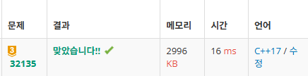

# 0309 코드 리뷰

# 백준 32135번 합성방진

## 문제 소개

### [문제 링크](https://www.acmicpc.net/problem/32135)

### 알고리즘 분류

해 구성하기, 수학, 정수론

### 문제 설명

크기 `n` 의 합성방진은 다음의 조건을 충족하는 `n * n` 의 2차원 배열이다.

```
1. 각 가로줄과 각 세로줄에는 1 이상 n 이하의 정수가 각각 정확히 한 번씩 등장한다.
2. 가로나 세로 방향으로 이웃한 두 수의 합은 모두 "합성수"이다.
```

크기 `n` 의 합성방진을 아무거나 하나 찾아 출력하시오.

### 입력

첫째 줄에 정수 `n`이 주어진다. `(8 <= n <= 500)` 

### 출력

크기 `n` 의 합성방진을 출력한다. `n` 줄에 걸쳐서, 각 줄에 `n` 개의 정수를 공백으로 구분하여 출력한다. 그러한 합성방진이 존재하지 않으면 `-1` 을 출력한다.

## 사고 과정

### 문제가 요구하는 것은?

문제 자체는 단순하다.

2가지의 조건을 만족하는 `n * n` 크기의 2차원 배열을 구하는 것.

일단, 첫번째 조건부터 살펴보자.

### 첫번째 조건을 만족하는 가장 간단한 방법

첫번째 조건을 만족하는 방법은 쉽게 떠올릴 수 있을 것이다.

첫째 줄을 정한다면 각각의 수를 다음과 같이 대각선 방향으로 배열하면 달성이 가능하다.

```
a b c d e f g h
b c d e f g h a
c d e f g h a b
			'''
h a b c d e f g
```

이렇게 하면 이웃한 수의 쌍의 집합은 `a-b`, `b-c` , … , `g-h`, `h-a` 가 된다.

이제 이웃 합이 모두 합성수인 원순열을 찾는 문제가 되었다.

### 두번째 조건을 만족하는 방법은?

두번째 조건의 핵심 포인트는 “**합성수**”라고 볼 수 있겠다.

두 수의 합이 합성수가 되려면 어떻게 해야할까?

.

.

.

정답은… 짝수 + 짝수 = 짝수, 홀수 + 홀수 = 짝수이므로 이를 이용하는 것이다…

자연수 중 2를 제외한 짝수는 필연적으로 2를 약수로 가지므로 모두 합성수이다.

그러면 짝수끼리, 홀수끼리 먼저 뭉쳐준다면 모든 쌍을 손쉽게 합성수로 만들 수 있다.

### 홀수 + 짝수 부분의 경계 처리

홀수와 짝수가 만날 수 밖에 없는 더해서 9가 나오는 쌍을 배치한다.

9는 10보다 작은 자연수 중 유일하게 홀수이지만 소수가 아닌 수이기 때문이다.

예를 들면 `n = 8` 일 때, `1 3 5 7 2 4 6 8` 을 돌려가며 출력하면 된다.

## 정답 코드

```cpp
#include <iostream>

using namespace std;

int N;
int square[500][500];

int main()
{
	cin.tie(NULL);
	ios::sync_with_stdio(false);

	cin >> N;
	
	if (N % 2 == 1)
	{
		for (int i = 0; i < N / 2; i++)
		{
			if (i < 3)
				square[0][i] = 2 * i + 1;
			else
				square[0][i] = 2 * (i + 1) + 1;
		}
		
		square[0][N / 2] = 7;

		for (int i = N / 2 + 1; i < N - 1; i++)
		{
			if (i - (N / 2) < 4)
				square[0][i] = 2 * (i - (N / 2));
			else
				square[0][i] = 2 * (i - (N / 2) + 1);
		}

		square[0][N - 1] = 8;
	}
	else
	{
		for (int i = 0; i < N / 2 - 1; i++)
		{
			if (i < 3)
				square[0][i] = 2 * i + 1;
			else
				square[0][i] = 2 * (i + 1) + 1;
		}

		square[0][N / 2 - 1] = 7;

		for (int i = N / 2; i < N - 1; i++)
		{
			if (i - (N / 2 - 1) < 4)
				square[0][i] = 2 * (i - (N / 2 - 1));
			else
				square[0][i] = 2 * (i - (N / 2 - 1) + 1);
		}

		square[0][N - 1] = 8;
	}

	for (int i = 1; i < N; i++)
	{
		square[i][0] = square[i - 1][N - 1];
		for (int j = 0; j < N - 1; j++)
		{
			square[i][j + 1] = square[i - 1][j];
		}
	}

	for (int i = 0; i < N; i++)
	{
		for (int j = 0; j < N; j++)
		{
			cout << square[i][j] << " ";
		}
		cout << "\n";
	}

	return 0;
}
```



### 교훈

그동안의 알고리즘 수업과 스터디를 겪으면서 우리는 시야가 좁아지지 않았나 한번 생각해보아야 한다.

 DFS, BFS, 다익스트라, Union-Find, MST… 많은 알고리즘들과

배열, 큐, 우선순위 큐… 다양한 자료구조를 학습하면서

문제를 보면 어떤 알고리즘을 쓸지, 어떤 자료구조를 쓸지 선택을 하는 데에만 치중하게 되었다.

앞으로 마주하게 될 다양한 유형의 문제와 알고리즘을 해결하기 위해선

생각의 폭을 넓히고 좀 더 문제의 해결방안에 대해 논리적 수학적으로 고심해보는 단계가 더욱 필요하다는 것을 느꼈다.
