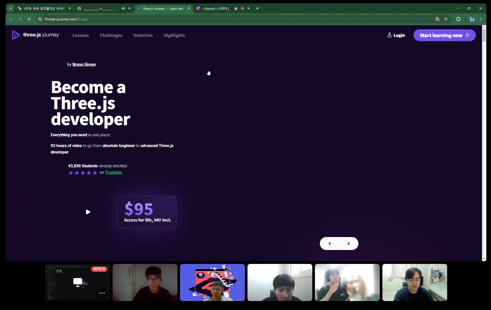

# 2월 온라인 스터디 결과 보고서

# 진행 일정 및 공부한 내용

## 2/8(토) - 알고리즘 문제 풀이 코드 리뷰, 웹 포트폴리오 레이아웃 발표

### 활동 사진

사진 1. 웹 개발 포트폴리오 레이아웃 발표

사진 2. 백준 9663번 N-Queen 문제 풀이 발표 1

사진 3. 코드 리뷰 발표 장면

사진 4. 백준 9663번 N-Queen 문제 풀이 발표 2

![사진 5. SWEA 4014번 [모의 SW 역량테스트] 활주로 건설 문제 발표](image%204.png)

사진 5. SWEA 4014번 [모의 SW 역량테스트] 활주로 건설 문제 발표

![사진 6. SWEA 2382번 [모의 SW 역량테스트] 미생물 격리 발표](image%205.png)

사진 6. SWEA 2382번 [모의 SW 역량테스트] 미생물 격리 발표

### 각자 조사한 포트폴리오 웹 사이트 레이아웃 공유 목록

### 정지유

1. [https://s8sachin.github.io/](https://s8sachin.github.io/)  간단한 구성의 매력이 있는 웹 페이지
2. [https://pandadev.net/projects/](https://pandadev.net/projects/) 슬롯머신 구현, 페이지의 크기에 따른 레이아웃의 전환 기법
3. [https://www.adeolaadeoti.site/](https://www.adeolaadeoti.site/) 부드러운 스크롤, 이미지 Hover시 나타나는 전환 효과
4. [https://bruno-simon.com/](https://bruno-simon.com/) 자동차 조작 게임과 웹 포트폴리오 결합
5. [https://www.dalelarroder.com/](https://www.dalelarroder.com/) 커서의 잔상 효과, 간결한 작업 포트폴리오 설명
6. [https://pscott.io/](https://pscott.io/) 매력적인 타이틀 화면
7. [https://nahuel61920.github.io/portafolio-Nahuel/](https://nahuel61920.github.io/portafolio-Nahuel/) 기업 스타일의 애니메이션 기법 구현
8. [https://bbangjo.kr/](https://bbangjo.kr/)  독특한 UX 설계와 자연스러운 외부 사이트 연계
9. [https://threejs-journey.com/](https://threejs-journey.com/) 재밌는 웹 분위기

### 윤대영

1. [https://lynnandtonic.com](https://lynnandtonic.com/)/ 한번에 보이는 메인 화면
2. [http://www.rleonardi.com/](http://www.rleonardi.com/) 횡스크롤을 이용해 게임처럼 만든 사이트
3. [https://brittanychiang.com/](https://brittanychiang.com/) 마우스 포인터 효과
4. [https://www.melaniedaveid.com/](https://www.melaniedaveid.com/) 스크롤 애니메이션을 활용
5. [https://www.adamho.com/](https://www.adamho.com/) 다양한 애니메이션 효과

### 박종원

1. [https://designembraced.com/](https://designembraced.com/)   그림과 텍스트 회전 애니메이션
2. [https://www.livingwithocd.info/](https://www.livingwithocd.info/) 도형의 회전, 형상, 색상 조작 기법
3. [https://www.robotoentertainment.com/](https://www.robotoentertainment.com/) 텍스트의 블라인드 애니메이션
4. [https://endspeciesism.org/](https://endspeciesism.org/) 움직이는 만화 형식을 구현
5. [https://sponsorships.aramco.com/](https://sponsorships.aramco.com/) 백그라운드 조작을 통한 물체 전시 효과

### 박성우

1. [https://aakash-sharma.netlify.app/](https://aakash-sharma.netlify.app/) 프론트엔드 개발자의 깔끔한 포트폴리오 디자인
2. [https://www.aayushkurup.dev/](https://www.aayushkurup.dev/) 깃허브의 분위기, 독창적인 숙련된 툴 소개 페이지
3. [https://abhishekkandel.com.np/](https://abhishekkandel.com.np/) 보기 좋은 Aside 레이아웃 디자인
4. [https://abhishekpanthee.com.np/](https://abhishekpanthee.com.np/) 블럭 스타일의 화면 구현, 심플한 디자인
5. [https://alejandro-gomez.vercel.app/](https://alejandro-gomez.vercel.app/) vsc의 개발환경과 유사한 독창적인 디자인
6. [https://tiagohermano.dev/](https://tiagohermano.dev/) 모달창으로 제작한 독특한 디자인의 웹 페이지
7. [https://kavan-bhavsar.vercel.app/](https://kavan-bhavsar.vercel.app/) 횡 이동 스크롤, 종료 시 다시 밑으로 가는 움직임을 구현
8. [https://p5aholic.me/](https://p5aholic.me/) 책 같은 형식의 웹 페이지, 애니메이션 크롤링 참고
9. [http://robinmastromarino.com/](http://robinmastromarino.com/) 옆으로 넘기는 방식의 웹 페이지를 구현

### 최규환

1. [https://khizarfareed.netlify.app/](https://khizarfareed.netlify.app/) 경력사항 반응형 웹 디자인, My Skills 애니메이션 게이지
2. [https://morelenyim.com/](https://morelenyim.com/) 웹 크기에 따라 목록을 반응형으로 제작, 커서 애니메이션
3. [https://dhruv-alpha.vercel.app/](https://dhruv-alpha.vercel.app/) 헤더 애니메이션, Flex-wrap 기법
4. [https://kim-ji-min.github.io/My-Portfolio/](https://kim-ji-min.github.io/My-Portfolio/) 스크롤에 따른 네비게이션 바 위치 조작
5. [http://kim-sunghwan.com/](http://kim-sunghwan.com/) 애니메이션 효과

### 코드 리뷰 개요

### 윤대영

1. Backtracking 6. N Queen
2. SWEA 4014. [모의 SW 역량테스트] 활주로 건설

> 아래와 같이 7단계에 걸쳐 주어진 알고리즘 문제 해결 전략을 발표.
> 
> 1. 문제 소개
> 2. 사고 과정
> 3. 의견 공유
> 4. 코딩 과정
> 5. 디버깅
> 6. 문제 해결 전략
> 7. 교훈

### 박성우

1. SWEA 2382. [모의 SW 역량테스트] 미생물 격리

> 주요 발표 내용
> 
> 1. 알고리즘 소개
> 2. 문제 해결 전략
> 3. 시간 복잡도 이슈 간략 소개
> 4. 최적화 방법
> 5. 아쉬운 점 회고

### 스터디 운영 방침 회의 및 관련 인프라 구축

### 깃허브 **Organization 생성**

1. 각자 repositorie 생성
2. 향후 포트폴리오 사이트 개발, 알고리즘 개념 설명을 위한 자료 업로드 용으로 사용 예정

### 스터디 일정 관리 구글 시트 작성

1. 각자 일주일 생활하면서 풀었던 알고리즘 중, 발표하고자 하는 문제 기록
2. 스터디 전 다른 사람이 풀이한 문제를 확인
3. 자신만의 풀이 전략을 구축한 후, 코드 리뷰 시 발표

## 2/9(일) - 문제 풀이 코드 리뷰, 알고리즘 유형 분석 토론

### 활동 사진

![사진 7. SWEA 4013번 [모의 SW 역량테스트] 특이한 자석 코드 리뷰](image%206.png)

사진 7. SWEA 4013번 [모의 SW 역량테스트] 특이한 자석 코드 리뷰

![사진 8. SWEA 5650번 [모의 SW 역량테스트] 핀볼 게임 코드 리뷰 1](image%207.png)

사진 8. SWEA 5650번 [모의 SW 역량테스트] 핀볼 게임 코드 리뷰 1

![사진 8. SWEA 5650번 [모의 SW 역량테스트] 핀볼 게임 코드 리뷰 2](image%208.png)

사진 8. SWEA 5650번 [모의 SW 역량테스트] 핀볼 게임 코드 리뷰 2

![사진 9. SWEA 2383번 [모의 SW 역량테스트] 점심 식사시간 코드 리뷰 발표 자료 중 일부](image%209.png)

사진 9. SWEA 2383번 [모의 SW 역량테스트] 점심 식사시간 코드 리뷰 발표 자료 중 일부

### 코드 리뷰 개요

### 최규환

1. SWEA 2383. [모의 SW 역량테스트] 점심 식사시간
    1. 문제 소개
    2. 사고 과정 : 문제 해결을 위한 접근 방법
    3. 풀이 과정 : 문제 풀이를 위한 코드 소개
    4. 첫 시도 : 디버깅 전 최초 시도 결과
    5. 디버깅 과정 : 코드 오류 분석
    6. 교훈 : 알고리즘을 풀며 깨달은 것
    7. 마무리 및 Q&A
    
    ⇒ 다음과 같은 단계를 거쳐 DFS와 시뮬레이션을 결합한 알고리즘 코드 리뷰를 완료
    

### 박종원

1. DAT 12. 세 수의 합
2. SWEA 4013. [모의 SW 역량테스트] 특이한 자석
    1. 문제 소개
    2. 접근 방법
    3. 해결 방법
    4. 첫 테스트 결과
    5. 디버깅 과정
    6. 해결 코드
    7. 교훈
    
    ⇒ 위와 같은 단계를 거치며 DAT 풀이 전략과 시뮬레이션 시 코드 간략화 방법을 피드백
    

### 정지유

1. SWEA 5650. [모의 SW 역량테스트] 핀볼 게임
    1. 문제 요약
    2. 문제 접근
    3. 코드 구현 과정
    4. 디버깅
    5. 깨달음
    6. 최종 코드 소개
    
    ⇒ 위와 같은 단계를 통해 시뮬레이션 문제 풀이 전략을 발표.
    

### 알고리즘 유형 분석 토론

### 재귀와 Backtracking

1. 재귀가 어려운 분들의 의견 피드백
    1. 무엇이 어려운지
    2. 어떤 부분이 이해가 안가는지
    3. 어떻게 활용해야 하는지
2. 해당 유형을 사용한 문제의 풀이 분석 : SWEA 3234. 준환이의 양팔저울
    1. 재귀 함수의 인수를 어떻게 설정해야 하는가.
    2. 재귀 함수는 인수 개수에 따라 어떻게 동작하는가.

### 구현 시, 구조체의 사용

1. 구조체의 기본 구조
2. 구조체의 필요성
3. 시뮬레이션에서 구조체를 어떻게 사용하는지
4. SWEA 4013. [모의 SW 역량테스트] 특이한 자석을 통한 구조체 사용 예시

## 2/16(일) - A형 역량테스트 대비 기출 풀이

### 활동 사진

![사진 10. SWEA 1767번 [SW Test 샘플문제] 프로세서 연결하기 코드 리뷰](image%2010.png)

사진 10. SWEA 1767번 [SW Test 샘플문제] 프로세서 연결하기 코드 리뷰

사진 11. SW 역량 테스트 대비 문제 사과 먹기 게임 코드 리뷰

![사진 12. SWEA 5648번 [모의 SW 역량테스트] 원자 소멸 시뮬레이션1](image%2012.png)

사진 12. SWEA 5648번 [모의 SW 역량테스트] 원자 소멸 시뮬레이션1

![사진 13. SWEA 5648번 [모의 SW 역량테스트] 원자 소멸 시뮬레이션2](image%2013.png)

사진 13. SWEA 5648번 [모의 SW 역량테스트] 원자 소멸 시뮬레이션2

## 2/22(토) - A형 역량테스트 복기 및 BFS, MST 유형 공략

### 활동 사진

사진 14. SW 역량테스트 기출 비료 주기 문제 풀이

사진 15. 백준 5214번 환승 문제 코드 리뷰1

사진 16. 백준 5214번 환승 문제 코드 리뷰2

사진 17. SW 역량 테스트 대비 기출 문제 풀이 장기 포 게임 코드 리뷰

사진 18. 백준 17472번 다리 만들기 2 코드 리뷰