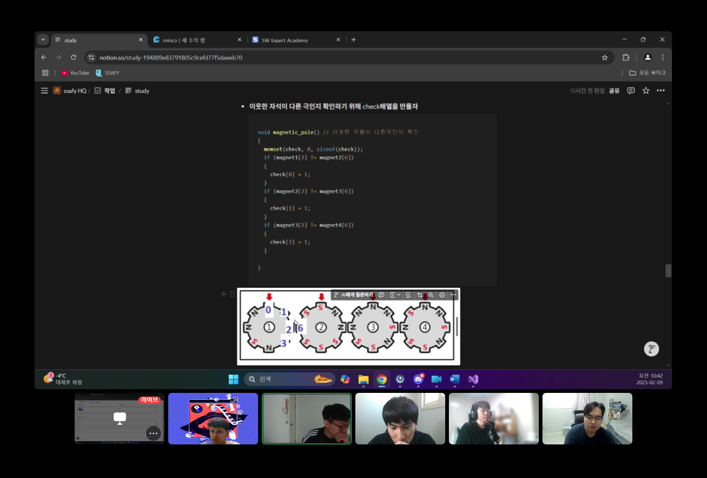

# 2월 2회차 사내용 스터디 - 250208

# 활동 사진

---

# 활동 내용

---

## 코드 리뷰

---

### 최규환

1. SWEA 2383. [모의 SW 역량테스트] 점심 식사시간
    1. 문제 소개
    2. 사고 과정 : 문제 해결을 위한 접근 방법
    3. 풀이 과정 : 문제 풀이를 위한 코드 소개
    4. 첫 시도 : 디버깅 전 최초 시도 결과
    5. 디버깅 과정 : 코드 오류 분석
    6. 교훈 : 알고리즘을 풀며 깨달은 것
    7. 마무리 및 Q&A
    
    ⇒ 다음과 같은 단계를 거쳐 DFS와 시뮬레이션을 결합한 알고리즘 코드 리뷰를 완료
    
    
    
    fig 1. SWEA 2383. 발표 자료 중 일부
    

### 박종원

1. DAT 12. 세 수의 합
2. SWEA 4013. [모의 SW 역량테스트] 특이한 자석
    1. 문제 소개
    2. 접근 방법
    3. 해결 방법
    4. 첫 테스트 결과
    5. 디버깅 과정
    6. 해결 코드
    7. 교훈
    
    ⇒ 위와 같은 단계를 거치며 DAT 풀이 전략과 시뮬레이션 시 코드 간략화 방법을 피드백
    
3. 발표 자료
    
    [https://mini-soccer-bce.notion.site/study-194889e83791805c9cefd77f5daeeb70?pvs=4](https://www.notion.so/194889e83791805c9cefd77f5daeeb70?pvs=21)
    

fig 2. SWEA 4013. 발표 자료 중 일부

### 정지유

1. SWEA 5650. [모의 SW 역량테스트] 핀볼 게임
    1. 문제 요약
    2. 문제 접근
    3. 코드 구현 과정
    4. 디버깅
    5. 깨달음
    6. 최종 코드 소개
    
    ⇒ 위와 같은 단계를 통해 시뮬레이션 문제 풀이 전략을 발표.
    
2. 발표 자료 
    
    [https://diligent-soybean-0ef.notion.site/1-25-02-08-193b157418ff800d8816f16cc4abd90c](https://www.notion.so/193b157418ff800d8816f16cc4abd90c?pvs=21)
    

![fig 3. SWEA 5650. [모의 SW 역량테스트] 핀볼 게임 발표 자료 중 일부](image%206.png)

fig 3. SWEA 5650. [모의 SW 역량테스트] 핀볼 게임 발표 자료 중 일부

## 알고리즘 유형 분석 토론

---

### 재귀와 Backtracking

1. 재귀가 어려운 분들의 의견 피드백
    1. 무엇이 어려운지
    2. 어떤 부분이 이해가 안가는지
    3. 어떻게 활용해야 하는지
2. 해당 유형을 사용한 문제의 풀이 분석 : SWEA 3234. 준환이의 양팔저울
    1. 재귀 함수의 인수를 어떻게 설정해야 하는가.
    2. 재귀 함수는 인수 개수에 따라 어떻게 동작하는가.

### 구현 시, 구조체의 사용

1. 구조체의 기본 구조
2. 구조체의 필요성
3. 시뮬레이션에서 구조체를 어떻게 사용하는지
4. SWEA 4013. [모의 SW 역량테스트] 특이한 자석을 통한 구조체 사용 예시

## 다음 스터디 일정 관련 회의

---

### 다음 일정 이슈 유, 무 파악

1. 정보처리기사 필기 시험 인원
2. 토요일 혹은 일요일 일정 체크

### 각자 스터디 자료 노션을 통한 공유

1. 노션의 게시 기능을 이용해 서로가 공유하기 용이하도록
2. 일정 관리 엑셀 시트에 각자의 노션 링크를 게시