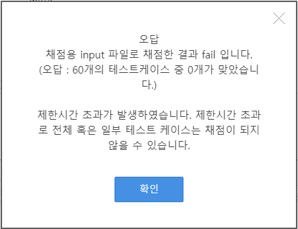

# 2차 알고리즘 리뷰

# SWEA 1767번 프로세서 연결하기

## 문제 링크

[SW Expert Academy](https://swexpertacademy.com/main/code/problem/problemDetail.do?contestProbId=AV4suNtaXFEDFAUf)

## 사고 과정

### 1. 구성 요소

- `N` : NxN = 프로세서의 크기 = cell의 개수 (7 ≤ N ≤ 12)
- `cells` : N의 최댓값인 12x12 크기의 2차원 배열, 프로세서
- `Core` : core의 좌표값, 연결된 가장자리의 방향 정보가 담겨 있는 구조체
- `cores` : 여러 개의 core 정보가 담겨 있는 구조체 배열
- `num_of_core` : core의 갯수
- `len` : 연결된 wire의 길이
- `cnt` : 연결된 core의 갯수

### 2. 문제가 요구하는 것은?


fig 1. 주어진 테스트 케이스 예제 이미지

> 문제에서 요구하는 주요 요건은 다음과 같다.
> 
> 
> **최대한 많은 Core**에 전원을 연결했을 경우, 전선 길이를 구하여라.
> 
> 단, 여러 방법이 있을 경우, **전선 길이가 최소가 되는 값**을 구하여라.
> 
1. **문제에서 요구하는 요건에서 제일 중요한 포인트는 “최대한 많은 Core”이다.**
    
    이 때, 가장 Best인 경우의 수는 모든 Core를 전원에 연결하는 것이다.
    
    하지만, 모든 테스트 케이스에서 전원을 연결할 수 있는 것은 아니다.
    
    Core에 연결된 전선은 무조건 직선이여야 하며, 다른 전선과 교차해서는 안되기 때문이다.
    
    
    
    fig 2. 전선이 교차하는 경우
    
2. **그 다음으로 중요한 것은 “최소한의 길이”다.**
    
    최대가 되는 core를 연결하는 경우의 수는 여러가지가 나올 수 있다.
    
    이 때, 전선의 길이를 비교하여 가장 최소가 되는 길이 값을 찾아야 한다.
    
3. **정리**
    
    Core를 연결할 수 있는 모든 경우의 수를 일단 따져보도록 하자.
    
    탐색 원리는 간단하다. 각 core 마다 연결 방향은 모두 4가지이다.
    
    모든 core를 순회하면서 4가지 중 1개의 방향으로 전선을 연결해주는 방식으로 구현한다.
    
    또한, 경우의 수를 1회 순회할 때마다 연결된 core의 개수를 비교하여 `max_val` 에 값을 저장해준다.
    
    만약 현재 레벨의 경우의 수에서 연결된 core의 개수가  `max_val` 과 같다면,
    
    전선의 길이 `len` 을 비교하여 둘 중, 더 작은 값을 `min_val` 에 넣어주면 될 것이다.
    

## 문제 풀이 및 디버깅

### 1. 1차 시기

1. **1차 시도 코드**
- 코드 보기
    
    ```cpp
    // SWEA 1767. [SW Test 샘플문제] 프로세서 연결하기
    #define _CRT_SECURE_NO_WARNINGS
    #include <iostream>
     
    using namespace std;
     
    int N, cnt, ans, max_val, num_of_core, len_of_wire;
    int cells[12][12];
    int origin[12][12];
     
    struct Core
    {
        int y, x;
        int p;  // core에 연결한 power의 면
    }cores[12];
     
    void init()
    {
        ans = 0;
        cnt = 0;
        max_val = 0;
        len_of_wire = 0;
    }
     
    void input()
    {
        cin >> N;
        int idx = 0;
        for (int i = 0; i < N; i++)
        {
            for (int j = 0; j < N; j++)
            {
                cin >> cells[i][j];
                origin[i][j] = cells[i][j];
                if (cells[i][j] == 1)
                {
                    cores[idx].y = i;
                    cores[idx].x = j;
                    cores[idx].p = -1;  // core에 아무런 전원도 인가하지 않은 상태
                    idx++;
                }
            }
        }
        num_of_core = idx;
    }
     
    bool cannot_connect(int idx, int power)
    {
        // power와 이미 인접한 cell인 경우
        if (cores[idx].y == 0 || cores[idx].y == N - 1 || cores[idx].x == 0 || cores[idx].x == N - 1)
        {
            return false;
        }
     
        // 연결해야 하는 power가 위쪽 방향인 경우
        if (power == 0)
        {
            for (int i = 0; i < cores[idx].y; i++)
            {
                if (cells[i][cores[idx].x] >= 1)
                {
                    return true;
                }
            }
        }
     
        // 연결해야 하는 power가 오른쪽 방향인 경우
        else if (power == 1)
        {
            for (int i = cores[idx].x + 1; i < N; i++)
            {
                if (cells[cores[idx].y][i] >= 1)
                {
                    return true;
                }
            }
        }
     
        // 연결해야 하는 power가 아래쪽 방향인 경우
        else if (power == 2)
        {
            for (int i = cores[idx].y + 1; i < N; i++)
            {
                if (cells[i][cores[idx].x] >= 1)
                {
                    return true;
                }
            }
        }
     
        // 연결해야 하는 power가 왼쪽 방향인 경우
        else if (power == 3)
        {
            for (int i = 0; i < cores[idx].x; i++)
            {
                if (cells[cores[idx].y][i] >= 1)
                {
                    return true;
                }
            }
        }
     
        return false;
    }
     
    void connect_wire(int idx, int power)
    {
        // power와 이미 인접한 cell인 경우
        if (cores[idx].y == 0 || cores[idx].y == N - 1 || cores[idx].x == 0 || cores[idx].x == N - 1)
        {
            return;
        }
     
        // 연결해야 하는 power가 위쪽 방향인 경우
        if (power == 0)
        {
            for (int i = 0; i < cores[idx].y; i++)
            {
                cells[i][cores[idx].x] = 2;
                //len_of_wire++;
            }
        }
     
        // 연결해야 하는 power가 오른쪽 방향인 경우
        else if (power == 1)
        {
            for (int i = cores[idx].x + 1; i < N; i++)
            {
                cells[cores[idx].y][i] = 2;
                //len_of_wire++;
            }
        }
     
        // 연결해야 하는 power가 아래쪽 방향인 경우
        else if (power == 2)
        {
            for (int i = cores[idx].y + 1; i < N; i++)
            {
                cells[i][cores[idx].x] = 2;
                //len_of_wire++;
            }
        }
     
        // 연결해야 하는 power가 왼쪽 방향인 경우
        else if (power == 3)
        {
            for (int i = 0; i < cores[idx].x; i++)
            {
                cells[cores[idx].y][i] = 2;
                //len_of_wire++;
            }
        }
    }
     
    void disconnect(int idx, int power)
    {
        if (cores[idx].y == 0 || cores[idx].y == N - 1 || cores[idx].x == 0 || cores[idx].x == N - 1)
        {
            return;
        }
     
        if (power == 0)
        {
            for (int i = 0; i < cores[idx].y; i++)
            {
                cells[i][cores[idx].x] = 0;
            }
        }
     
        else if (power == 1)
        {
            for (int i = cores[idx].x + 1; i < N; i++)
            {
                cells[cores[idx].y][i] = 0;
            }
        }
     
        else if (power == 2)
        {
            for (int i = cores[idx].y + 1; i < N; i++)
            {
                cells[i][cores[idx].x] = 0;
            }
        }
     
        else if (power == 3)
        {
            for (int i = 0; i < cores[idx].x; i++)
            {
                cells[cores[idx].y][i] = 0;
            }
        }
    }
     
    void select_power(int lev)
    {
        if (lev == num_of_core)
        {
            for (int i = 0; i < N; i++)
            {
                for (int j = 0; j < N; j++)
                {
                    if (cells[i][j] == 2)
                    {
                        len_of_wire++;
                    }
                }
            }
     
            if (max_val < cnt)
            {
                max_val = cnt;
                ans = len_of_wire;
            }
            if (max_val == cnt && ans > len_of_wire)
            {
                ans = len_of_wire;
            }
            len_of_wire = 0;
            return;
        }
     
        for (int i = 0; i < 4; i++)
        {
            if (cannot_connect(lev, i))
            {
                continue;
            }
            cores[lev].p = i;
            connect_wire(lev, i);
            cnt++;
            select_power(lev + 1);
            disconnect(lev, i);
            cnt--;
            cores[lev].p = -1;
        }
    }
     
    int main()
    {
        //freopen("input.txt", "r", stdin);
     
        int T, tc;
        cin >> T;
        for (tc = 1; tc <= T; tc++)
        {
            init();
            input();
            select_power(0);
            cout << "#" << tc << " " << ans << "\n";
        }
     
        return 0;
    }
    ```
    
1. **제출 결과 : FAIL**
    
    첫 시기에서 주어진 예제 케이스들을 모두 맞추고 제출을 해봤지만 총 60개의 테스트 케이스 중,
    
    약 3분의 2 이상을 맞추고 FAIL이 나왔다.
    
2. **문제점**
    
    그렇다면 해당 코드의 문제점은 무엇일까?
    
    일단, 모든 경우의 수를 탐색할 수 없었다.
    
    왜냐하면 치명적인 사실 한 가지를 간과하고 있었기 때문이다.
    
    그것은…
    
    모든 core를 굳이 power에 연결해주지 않아도 된다는 것이었다,
    
    즉, core 한개마다 선택해주는 가짓수는 다음과 같다.
    
    1. 윗 방향 power에 연결하는 경우
    2. 아랫 방향에 연결하는 경우
    3. 왼쪽 방향에 연결하는 경우
    4. 오른쪽 방향에 연결하는 경우
    5. **연결을 하지 않는 경우**(New!)
    
    연결을 하지 않는 경우의 수를 재귀 함수 안에 추가 시켜주면 될 듯 하다.
    

### 2. 2차 시기

1. **개선 코드**
    
    연결을 하지 않는 경우를 추가 시켜 주기 위해 
    
    다음과 같이 path의 가짓수를 총 5가지로 늘려주었다.
    
    ```cpp
    for (int i = 0; i < 5; i++)
        {
            cores[lev].p = i;
     
            if (cannot_connect(lev))
            {
                cores[lev].p = 0;
            }
     
            install_wire(lev, cores[lev].p);
     
            connect(lev + 1);
     
            len = len - disconnect(lev, cores[lev].p);
     
            cores[lev].p = -1;
        }
    ```
    
    path가 늘어난 만큼 마찬가지로 
    
    나머지 함수에도 아래와 같이 경우의 수에 따른 로직 처리를 수정해주었다.
    
    ```cpp
    // power와 연결하지 않는 경우
        if (cores[idx].p == 0)
        {
            return true;
        }
    ```
    
2. **제출 결과**
    
    
    
    fig 3. Time out
    
    시간 초과가 났다.
    
    이 때부터 정신이 혼미해지기 시작했다.
    
    사실 1차시기 때에도 코드 실행시간이 아슬아슬 하긴 했는데,
    
    경우의 수를 1가지 추가 해주자마자 당연하게도 시간초과가 난 것이다.
    
3. **문제점**
    
    시간 초과를 줄일 수 있는 방안을 생각해보자.
    
    1. **일단 가장 자리에 있는 core는 고려하지 말자!**
        
        
        
        fig 4. 가장 자리에 Core가 위치한 경우
        
        문제에서 가장 자리에 있는 core는 이미 연결이 되었다고 가정했다.
        
        그렇다면 굳이 탐색하지 않아도 되는 부분이었다.
        
    2. **core의 개수와 wire의 길이를 구할 때, 일일이 순회하지 말자.**
        
        매번 재귀를 돌릴 때마다, 연결된 core의 개수를 구하기 위해
        
        2차원 배열을 순회하면서 연결된 core의 cnt를 +1 해주었다.
        
        하지만 이 과정은 시간적으로 매우 손해를 보는 방법이다.
        
        연결된 core의 개수를 구하기 위해 2차원 배열을 매번 순회하기 보다는
        
        재귀 직전 연결하는 power를 선택할 때 cnt를 증가시켜주기로 했다.
        

### 3. 3차 시기

1. **제출 결과**
    
    문제점과 개선 방안은 위에서 설명했으므로, 빠르게 제출 결과를 보도록 하자.
    


fig 5. 계속해서 겪은 시간 초과

1. **문제점**
    
    이 때부터 디버깅에 많은 힘이 들었던 것 같았다.
    
    계속해서 겪는 시간 초과 문제를 해결하기 위해서는 근본적인 백트래킹 구조를 개선해야 할 것 같았다.
    
    그렇게 해서 코드를 찾는 찰나,
    
    **SWEA 3234번 준환이의 양팔저울 문제**가 떠올랐다.
    
    [SW Expert Academy](https://swexpertacademy.com/main/code/problem/problemDetail.do?contestProbId=AWAe7XSKfUUDFAUw)
    
    해당 문제 또한, DFS 유형의 문제이다.
    
    또한, 단순 DFS로 무작정 완전 탐색을 시도하다가는 시간 초과의 늪에 빠질 수 있는 대표적인 문제이다.
    
    양팔 저울 문제에서 시간 초과를 해결하기 위해서는 다음과 같은 전략을 쓴 바 있었다.
    
    **남은 무게 추의 합을 모두 더해도 오른쪽 저울의 무게가 왼쪽을 넘지 못하면 즉시 재귀를 종료.**
    
    즉, 굳이 탐색을 하지 않아도 되는 부분을 최대한 **가지치기** 하는 것이 관건이었다.
    
2. **해결 방안**
    
    그렇다면 SWEA 1767번 프로세서 연결하기로 돌아와서
    
    내 코드에 적용할 수 있는 해결방안은 무엇일까?
    
    바로…
    
    core에 연결할 power를 정할 때, 남은 core를 모두 연결해도 `max_val` 를 넘을 수 없다면,
    
    즉시 재귀를 종료하는 것이다.
    
    어차피 구해야하는 문제의 요점은 바로 그것이다.
    
    **“최대한 많은 수가 연결된 core” 일 때의 경우**
    
    이 경우 말고는 다른 경우의 수는 고려할 필요조차 없던 것이다.
    

### 4. 4차 시기

1. **개선 코드**
    
    ```cpp
    for (int i = 0; i < 5; i++)
        {
            cores[lev].p = i;
     
            if (cannot_connect(lev))
            {
                cores[lev].p = 0;
            }
     
            if (num_of_core - lev + cnt < max_val)
            {
                continue;
            }
     
            install_wire(lev, cores[lev].p);
     
            connect(lev + 1);
     
            disconnect(lev, cores[lev].p);
     
            cores[lev].p = -1;
        }
    ```
    
    재귀 부분에 max_val과 남은 core의 개수를 비교 해주는 로직을 추가했다.
    
    로직 자체는 간단하다.
    
    core의 총 개수인 `num_of_core` 에 현재 레벨을 빼준 값.
    
    즉, 아직 path가 결정 되지 않은 core의 개수에 지금까지 연결한 core의 개수인 `cnt` 를 더해준 값이 `max_val` 을 넘을 수 없다면, `continue` 를 통해 탐색을 해주지 않고 넘어갈 수 있도록 해주었다.
    
2. **결과**
    
    
    
    fig 6. 11차 제출만에 PASS 획득
    
    결국 11차 제출 만에 PASS를 따낼 수 있었다.
    
    시간 초과 문제를 해결 하자마자 바로 PASS가 나왔다.
    
    
    
    fig 7. 실행시간
    
    코드 실행시간은 총 29ms로 문제의 제한 시간인 2000ms에 비해 압도적으로 줄어들었다.
    
    정말 가지치기 하나만 해준 것으로 드라마틱한 결과를 도출했다.
    

## 교훈

SWEA 1767번 프로세서 연결하기 문제를 풀면서

많은 교훈을 얻었다.

일단 지금까지 나는 알고리즘 문제 풀이는 정답만 나오면 장땡이라고 믿고 있었다.

But, 시간 초과와 치열한 혈투를 벌이면서 정답을 도출하는 것만이 아니라 전체적인 구조를 잘 파악하고 불필요한 로직을 최소화 하는 작업이 역량 테스트나 기업 코테를 PASS 할 때, 더욱 필요한 무기가 아닐까 하는 생각이 들게 되었다.

DFS 혹은 백트래킹을 하면서 가지치기를 하는 작업은 생각 이상으로 중요한 작업이었다.

또한 이 가지치기를 잘 해내기 위해서는 재귀라는 로직에 대해 제대로 이해하고 있어야 가능한 작업일 것이다.

단순히 구조만 외워서 DFS를 풀려고 한다면, 절대 이 작업을 해낼 수 없을 것이다.

DFS와 재귀에 대해 제대로 개념을 이해하는 것이 왜 필수인지 깨닫게 해주었다.

## PASS 코드 전체

```cpp
// SWEA 1767번 [SW Test 샘플문제] 프로세서 연결하기
#define _CRT_SECURE_NO_WARNINGS
#include <iostream>
 
using namespace std;
 
struct Core
{
    int y, x;
    int p;
}cores[12];
 
int N, ans, cnt, len, num_of_core;
int max_val, min_val;
int cells[12][12];
 
void init()
{
    ans = 0;
    cnt = 0;
    max_val = 0;
    min_val = 144;
}
 
void input()
{
    cin >> N;
    int idx = 0;
    for (int i = 0; i < N; i++)
    {
        for (int j = 0; j < N; j++)
        {
            cin >> cells[i][j];
            if (cells[i][j] == 1 && i != 0 && j != 0 && i != N - 1 && j != N - 1)
            {
                cores[idx].y = i;
                cores[idx].x = j;
                cores[idx].p = -1;
                idx++;
            }
        }
    }
    num_of_core = idx;
}
 
bool cannot_connect(int idx)
{
    // power와 연결하지 않는 경우
    if (cores[idx].p == 0)
    {
        return true;
    }
 
    // 연결해야 하는 power가 위쪽 방향인 경우
    else if (cores[idx].p == 1)
    {
        for (int i = cores[idx].y - 1; i >= 0; i--)
        {
            if (cells[i][cores[idx].x] >= 1)
            {
                return true;
            }
        }
    }
 
    // 연결해야 하는 power가 아래쪽 방향인 경우
    else if (cores[idx].p == 2)
    {
        for (int i = cores[idx].y + 1; i < N; i++)
        {
            if (cells[i][cores[idx].x] >= 1)
            {
                return true;
            }
        }
    }
 
    // 연결해야 하는 power가 왼쪽 방향인 경우
    else if (cores[idx].p == 3)
    {
        for (int i = 0; i < cores[idx].x; i++)
        {
            if (cells[cores[idx].y][i] >= 1)
            {
                return true;
            }
        }
    }
 
    // 연결해야 하는 power가 오른쪽 방향인 경우
    else if (cores[idx].p == 4)
    {
        for (int i = cores[idx].x + 1; i < N; i++)
        {
            if (cells[cores[idx].y][i] >= 1)
            {
                return true;
            }
        }
    }
 
    return false;
}
 
void install_wire(int idx, int power)
{
    // 연결 안(혹은 못)하는 경우
    if (power == 0)
    {
        return;
    }
 
    // 연결해야 하는 power가 위쪽 방향인 경우
    if (power == 1)
    {
        for (int i = 0; i < cores[idx].y; i++)
        {
            cells[i][cores[idx].x] = 2;
            len++;
        }
        cnt++;
    }
 
    // 연결해야 하는 power가 아래쪽 방향인 경우
    else if (power == 2)
    {
        for (int i = cores[idx].y + 1; i < N; i++)
        {
            cells[i][cores[idx].x] = 2;
            len++;
        }
        cnt++;
    }
 
    // 연결해야 하는 power가 왼쪽 방향인 경우
    else if (power == 3)
    {
        for (int i = 0; i < cores[idx].x; i++)
        {
            cells[cores[idx].y][i] = 2;
            len++;
        }
        cnt++;
    }
 
    // 연결해야 하는 power가 오른쪽 방향인 경우
    else if (power == 4)
    {
        for (int i = cores[idx].x + 1; i < N; i++)
        {
            cells[cores[idx].y][i] = 2;
            len++;
        }
        cnt++;
    }
}
 
void disconnect(int idx, int power)
{
    if (power == 0)
    {
        return;
    }
 
    else if (power == 1)
    {
        for (int i = 0; i < cores[idx].y; i++)
        {
            cells[i][cores[idx].x] = 0;
            len--;
        }
        cnt--;
    }
 
    else if (power == 2)
    {
        for (int i = cores[idx].y + 1; i < N; i++)
        {
            cells[i][cores[idx].x] = 0;
            len--;
        }
        cnt--;
    }
 
    else if (power == 3)
    {
        for (int i = 0; i < cores[idx].x; i++)
        {
            cells[cores[idx].y][i] = 0;
            len--;
        }
        cnt--;
    }
 
    else if (power == 4)
    {
        for (int i = cores[idx].x + 1; i < N; i++)
        {
            cells[cores[idx].y][i] = 0;
            len--;
        }
        cnt--;
    }
}
 
void connect(int lev)
{
    if (lev == num_of_core)
    {
        if (max_val < cnt)
        {
            ans = len;
            max_val = cnt;
        }
 
        else if (max_val == cnt && ans > len)
        {
            ans = len;
        }
 
        return;
    }
 
    for (int i = 0; i < 5; i++)
    {
        cores[lev].p = i;
 
        if (cannot_connect(lev))
        {
            cores[lev].p = 0;
        }
 
        if (num_of_core - lev + cnt < max_val)
        {
            continue;
        }
 
        install_wire(lev, cores[lev].p);
 
        connect(lev + 1);
 
        disconnect(lev, cores[lev].p);
 
        cores[lev].p = -1;
    }
}
 
int main()
{
    cin.tie(NULL);
    ios_base::sync_with_stdio(false);
    //freopen("input.txt", "r", stdin);
 
    int T, test_case;
    cin >> T;
 
    for (test_case = 1; test_case <= T; test_case++)
    {
        init();
        input();
        connect(0);
        cout << "#" << test_case << " " << ans << "\n";
    }
}
```